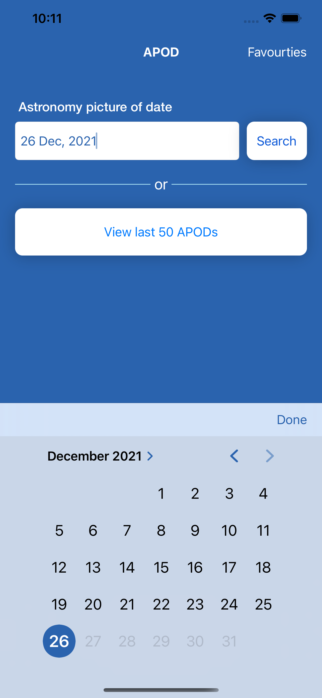
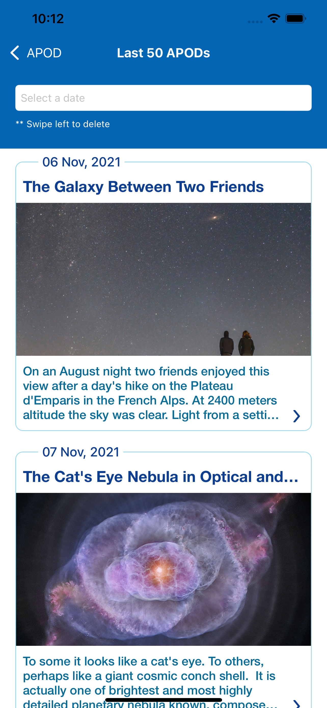
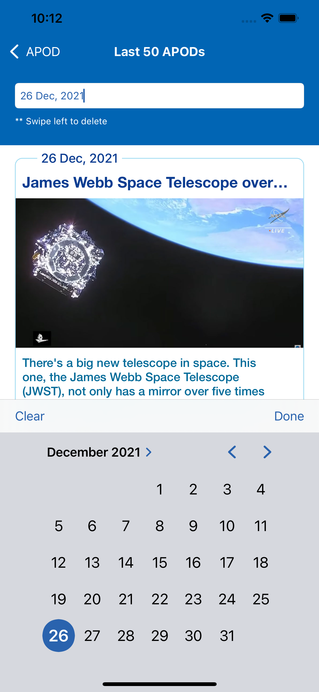
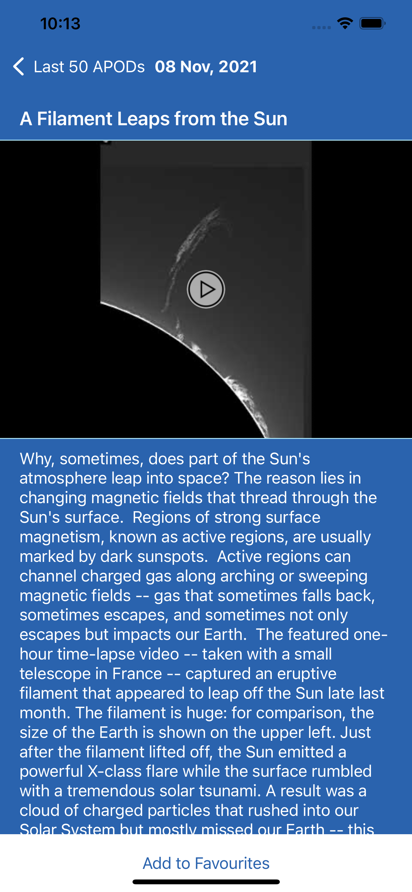
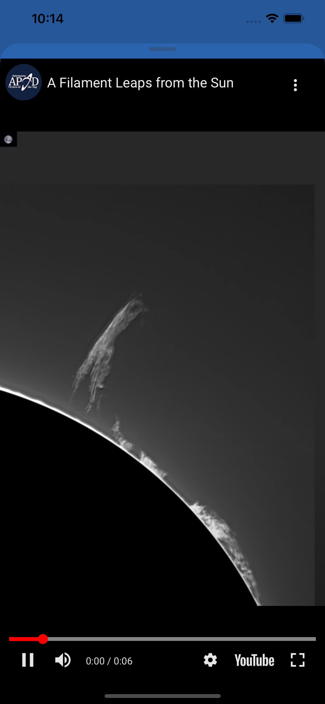
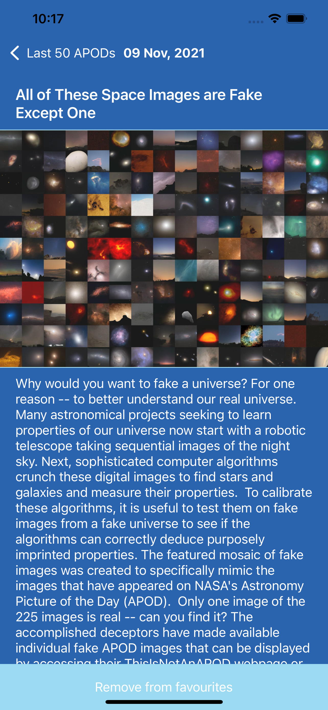

# NasaAPOD

## Technical Description:

### App Runs on Swift 5 + iOS 15 (for testing only traget can be changed) 
### App Folows MVVM+R pattern where R = router for navigation
### App has Test cases just(for viewModels and few files) to show case.(by slather non - required files are added to slather ignore list)
### App codsiders that, APOD can be a video or an Image, as per NASA API response(it sends media_type)
### App Uses CoreData for storage purpose
### One might require latest XCOde 13 to run the app
### App Uses, **YoutubeiOSPlayerHelper** Library, in order to play youtube video lineks(send by NSAS API, which AVplayer was not suppotrting)
### App Uses, **Slather via gem file** , in order to generate test report which out considering UI and other non - testable code

## App Flow
### Home Screen consists of 4 Sub Flows
### Cell in the list will show few details only, to view full you must go to the detail screen. After few lines the lable insde cell truncates(both title and description), its on purpose to lure the user get inside the details.
#### 1 User can select a date and tap on search to get the APOD for that Date, which will hit the api and shows him the data on next screen.

#### 2 User can Go to search History(Recent searches), app stores all the searches whic user does via searh flow. 
            **2.1 Here user can delete the data parmanently via swipe to delete.**
            **2.1. Here user can search on the basis of date.**
            **2.1. Here user can click on any cell to view details**

#### 3 User can go to Favourites, which will show the list of favouries, marked by the user
            **3.1  Here user can delete the APOD data permanetly via swipe to delete action in the list**
            **3.2 User can click to View details, and on the detail page user can unmark the APOD asnon-faourites**
            **3.3 Here user can search on the basis of date.**

#### 4: User can click on view last 50 APODs, which will show the list of APODs for the last 50 days
            **4.1 User can click to View details, and on the detail page user can unmark the APOD asnon-faourites**
            **4.2 Here user can search on the basis of date.**

### 5: Details Screen: It shows the details of APOD (all the requried data fields), common in all submodules
            **5.1 User can click on the media, to view media on full screen zoom-in/out is supported** 
            **5.2 User can click on the media, to view Video on full screen (AVplayer for normal video url and YoutubeHelper for Youtube linkes)[swipe down to dismiss view]** 
            **5.3 User can add or remove this APOD from favourites**
            ***If you view any APOD in details it will be saved in Core Data(I consider it to be a search history)***

